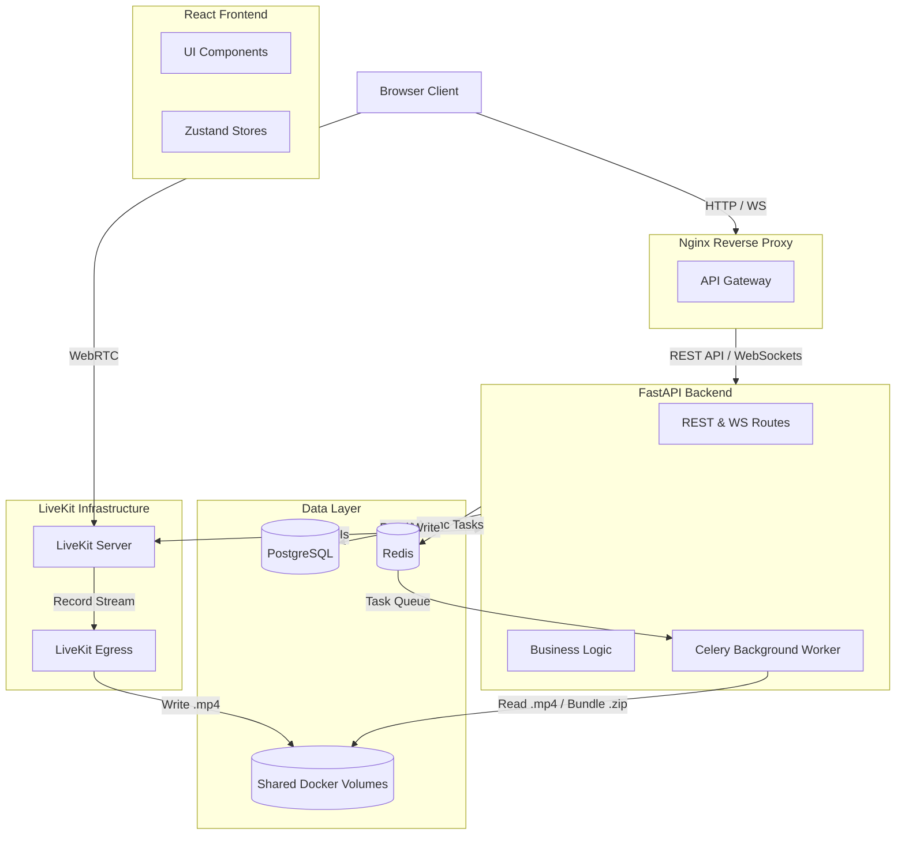

<div align="center">
  <h1>⚛️ AtomQuest</h1>
  <p><b>The Ultimate Real-Time Video & Chat Support Platform</b></p>
  <p><i>Empowering support teams with frictionless, self-hosted, ultra-low latency customer interactions.</i></p>
  
  [](https://fastapi.tiangolo.com/)
  [](https://reactjs.org/)
  [](https://livekit.io/)
  [](https://www.docker.com/)
  [](https://www.postgresql.org/)
</div>

<br />

## 🌟 Overview

**AtomQuest** is a comprehensive, browser-based real-time customer support platform designed to rival enterprise solutions like Zoom and Zendesk. Built with a modern, high-performance tech stack, it enables agents to create secure support rooms, invite customers via ephemeral links, and communicate through ultra-low latency HD video and synchronous chat.

Every session can be recorded, securely archived, and downloaded directly from the agent's dashboard. Complete with a real-time admin metrics dashboard, AtomQuest is the ultimate all-in-one support suite.

---

## ✨ Key Features

- **🎥 Ultra-Low Latency Video Rooms:** Powered by self-hosted LiveKit and WebRTC for crisp, real-time video and screen sharing.
- **💬 Synchronous Real-Time Chat:** Integrated WebSocket chat with live typing indicators and connection status.
- **⏺️ Session Recording & Archiving:** Seamlessly record both video and chat streams. AtomQuest uses LiveKit Egress via Celery background workers to render the stream into a downloadable `.mp4` and securely bundles it alongside chat logs and uploaded media into a `.zip` archive.
- **🔗 Ephemeral Join Links:** Agents generate secure, one-time join links. Customers simply enter their name—no account creation required.
- **📎 File Sharing:** Bi-directional file uploads (PDF, PNG, JPG) supported directly in the chat panel.
- **📊 Real-Time Admin Dashboard:** Live system health monitoring, tracking active WebSocket connections, active participants, and ongoing sessions.
- **📱 Responsive UI:** Fully mobile-friendly interface crafted with Tailwind CSS for support on-the-go.

---

## 🏗️ Architecture

AtomQuest utilizes a modern, distributed microservices architecture designed for scalability and fault tolerance.



---

## 🛠️ Technology Stack

| Component | Technologies Used |
|-----------|------------------|
| **Frontend UI** | React 18, Vite, Tailwind CSS, Zustand, React Hook Form, Zod |
| **Backend API** | FastAPI, Python 3.12, Uvicorn, WebSockets, JWT Authentication |
| **Database & ORM** | PostgreSQL, SQLAlchemy, Alembic (Migrations) |
| **Message Broker / Cache** | Redis |
| **Background Processing** | Celery |
| **Real-Time Video** | LiveKit Server, LiveKit Egress, LiveKit React Components |
| **Deployment** | Docker, Docker Compose, Nginx |

---

## 🚀 Getting Started

Getting AtomQuest up and running is frictionless thanks to our comprehensive Docker Compose setup.

### Prerequisites
- [Docker](https://docs.docker.com/get-docker/) and [Docker Compose](https://docs.docker.com/compose/install/)
- Node.js 20+ (if running the frontend locally)
- Python 3.12+ (if running the backend locally)

### 1. Environment Setup

Clone the repository and copy the environment template:
```bash
git clone https://github.com/Prabhatsingh001/Atomquest-Finale.git
cd Atomquest-Finale
cp .env.example .env
```

*Note: The `.env.example` comes pre-configured with secure default API keys and passwords for local development.*

### 2. Launching with Docker (Recommended)

AtomQuest relies on multiple interlocking services (PostgreSQL, Redis, LiveKit, Egress, Celery). Docker Compose is the easiest way to launch the entire stack:

```bash
docker-compose up --build -d
```

This will spin up:
- **Frontend** at `http://localhost:5173`
- **Backend API** at `http://localhost:8000`
- **Nginx Proxy** at `http://localhost:80`
- **LiveKit Server** at `ws://localhost:7880`
- **Postgres, Redis, Celery, & Egress** in the background.

### 3. Default Credentials

Once the system is running, you can log in immediately:

| Role | Email | Password |
|---|---|---|
| **Admin** | `admin@atomquest.com` | `admin123` |
| **Agent** | `agent@atomquest.com` | `agent123` |

*(Customers do not need credentials; they join via an ephemeral link generated by the Agent).*

---

## 📁 Project Structure

```text
AtomQuest/
├── backend/                   # Python FastAPI application
│   ├── alembic/               # Database migration scripts
│   ├── app/                   # Core application logic
│   │   ├── core/              # Config, Security, Celery initialization
│   │   ├── db/                # Database engine & seed data
│   │   ├── modules/           # Domain-driven feature modules (Auth, Chat, Sessions)
│   │   └── tasks/             # Celery background workers
│   └── requirements.txt
├── frontend/                  # React + Vite application
│   ├── src/
│   │   ├── components/        # Reusable UI components (VideoRoom, ChatPanel)
│   │   ├── pages/             # Route-level views (Dashboard, ActiveCall)
│   │   ├── services/          # API integration layer
│   │   └── stores/            # Zustand global state
├── livekit.yaml               # LiveKit Server configuration
├── docker-compose.yml         # Container orchestration
└── .env                       # Environment variables
```

---

## 📖 API Documentation

The backend is fully self-documenting. Once the backend container is running, navigate to:

- **Swagger UI:** `http://localhost:8000/docs`
- **ReDoc:** `http://localhost:8000/redoc`

All endpoints are strictly typed with Pydantic schemas and properly documented using Google-style docstrings.

---

## 🎯 Hackathon Highlights & Engineering Milestones

- **Zero-Friction Recording Pipeline:** By bridging LiveKit Egress with a distributed Celery worker, we bypassed the notorious complexity of rendering WebRTC streams. The video is rendered headlessly, captured in a shared Docker volume, zipped alongside the WebSocket chat logs, and served directly to the agent's browser as a `.zip` archive.
- **Robust State Management:** Combining Zustand for localized component state and LiveKit's real-time SyncState ensures that when a participant drops and reconnects, they are immediately re-synchronized with the room's live context without missing a beat.
- **Architectural Scalability:** By enforcing strict domain-driven module separation (`auth`, `sessions`, `chat`, `recordings`), the backend is deeply modular and pre-optimized for horizontal scaling.

---

<div align="center">
  <i>Built with ❤️ for the Hackathon</i>
</div>
